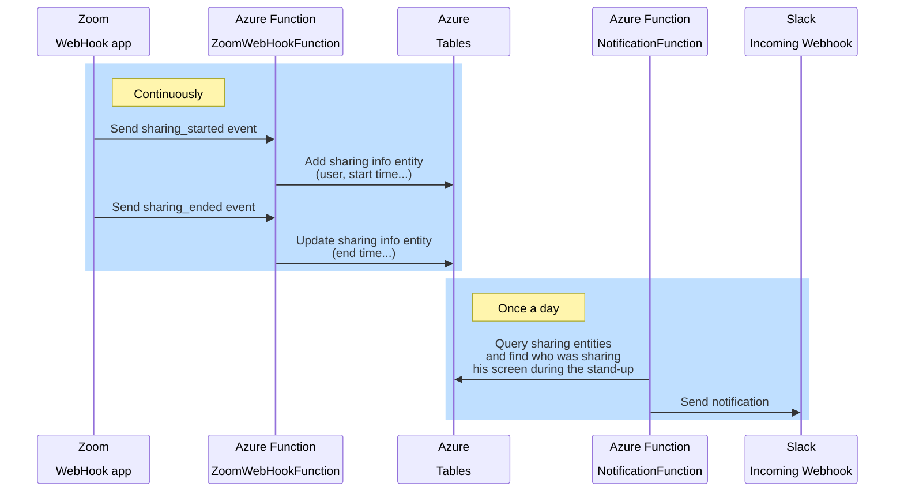

# CestKiKi Azure functions

## Summary
You are running a daily stand-up meeting on Zoom with a rolling presenter and you always forget who was presenting the day before?

This project is for you!

## General design
CestKiki runs serverless, on the cloud. It uses webhooks to receive notifications about Zoom screen sharings and stores needed infos into an Azure Table. Once a day, it queries the Table to find who was sharing his screen during the stand-up and send a Slack notification.

## Configuration
### Azure
- Create a new Azure Function App (a new Storage account should be automatically created)
### Zoom
- Create a [Webhook only app](https://marketplace.zoom.us/docs/guides/build/webhook-only-app/) on the [Zoom Marketplace](https://marketplace.zoom.us/develop/create)
- Use the generated **Secret Token** for the Azure Function configuration below
- Use the *https://[AZURE_FUNCTION_NAME].azurewebsites.net/api/ZoomWebHook* URL for the **Event notification endpoint** 
- Enable **Event Subscriptions** for the following events:
  - Participant/Host left meeting
  - Meeting Sharing Started
  - Meeting Sharing Ended
### Slack
- Create a [new App](https://api.slack.com/apps) in your workspace
- Activate the [Incoming Webhooks](https://api.slack.com/messaging/webhooks), create a new Webhook for your channel and use the generated URL for the Azure Function configuration below
### Azure
- Edit the Function App Configuration and add the following settings:
  - `Notification:StandUpTimeZone = Europe/Paris` *(Zone ID from https://nodatime.org/TimeZones)*
  - `Notification:StandUpStartTime = 10:15:00`
  - `Notification:StandUpEndTime = 10:30:00`
  - `Notification:NotificationTime = 10:30:00`
  - `NotificationCron = 0 30 * * * *` *(The Azure function should run at the same time as the NotificationTime)*
  - `Notification:WebHook = https://hooks.slack.com/services/[...]` *(Slack Incoming Webhook configured above)*
  - `Zoom:MonitoredRoom = 123456789` *(Zoom room id where the stand-up occurs)*
  - `Zoom:WebHookSecret = [...]` *(Secret Token from Zoom generated above)* 
- Edit Networking -> Inbound Traffic -> Access restriction and add the [Zoom IP ranges](https://marketplace.zoom.us/docs/api-reference/webhook-reference/#ip-addresses)
- Deploy CestKiKi app on Azure

## Compilation and Deployment
CestKiKi requires the following components:
- [.NET 6.0 SDK](https://dotnet.microsoft.com/download/dotnet/6.0)
- [Azure Functions Core Tools V4](https://docs.microsoft.com/en-us/azure/azure-functions/functions-run-local#install-the-azure-functions-core-tools)

The solution can be loaded and published as-is to the Azure Function App. A fair amount of unit tests are written as debugging Azure Function live could be tedious.
